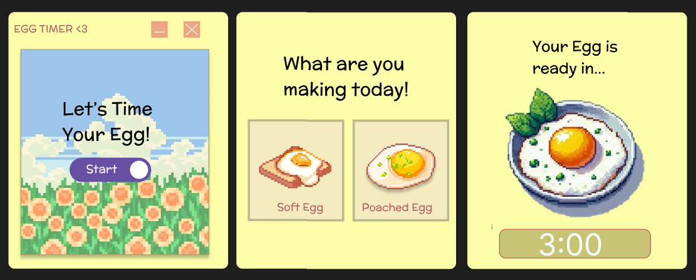

# 🍳 Egg Timer <3

A cute, pixel-art style desktop egg timer application built with Electron.js! 

I designed this app in Figma and brought it to life using HTML, CSS, and JavaScript. It features a custom frameless window, pixel-art graphics, and a functional countdown timer to help you cook the perfect egg.

## ✨ Features
* **Custom UI:** A fully custom desktop window with functional minimize and close buttons.
* **Pixel Art Aesthetic:** Styled with custom Figma graphics, pastel colors, and the VT323 retro font.
* **Interactive Menus:** Animated hover states and smooth screen transitions.
* **Functional Timer:** Select between a Soft Egg (3 minutes) or a Poached Egg (5 minutes) and watch the countdown!

## 📸 Screenshots

## 💻 Tech Stack
* **Electron.js:** For packaging the web code into a native desktop application.
* **HTML5 & CSS3:** For structuring the application screens and styling.
* **Vanilla JavaScript:** For the timer logic and screen switching.
* **Figma:** For designing the UI and pixel art assets.

## 🚀 How to Run the App Locally
If you want to download and run this app on your own computer, follow these steps:

1. Clone this repository:
   `git clone https://github.com/YOUR-USERNAME/egg-timer.git`
2. Navigate into the project folder:
   `cd egg-timer`
3. Install the required dependencies:
   `npm install`
4. Start the app:
   `npm start`